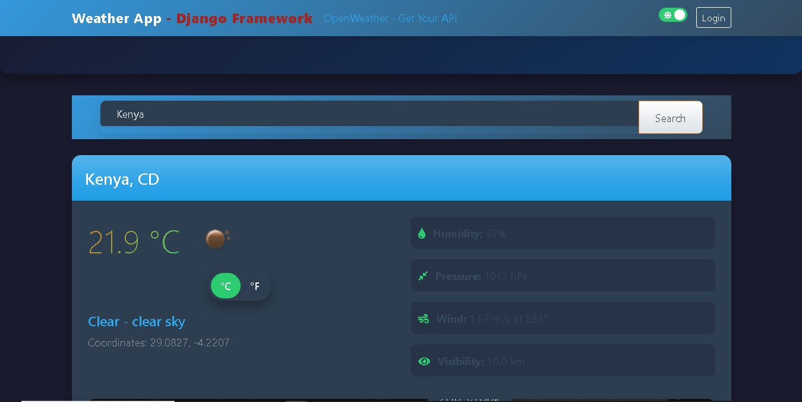

# Weather App

A comprehensive weather application built with Django that provides detailed weather information for locations worldwide.

## Overview

This Weather App was developed as a Power Learn Project assignment for Python Week 8 by Sydwell Lebeloane. It leverages the OpenWeatherMap API to provide real-time weather data with an intuitive and responsive user interface.

## Features

### Core Features
- **Weather Information**: Display of current weather conditions including temperature, humidity, pressure, wind speed, and visibility
- **City Search**: Search for weather data by city name
- **Location Autocomplete**: Suggestions appear as you type for more accurate location selection
- **Favorites**: Save and manage favorite locations (requires login)

### Enhanced Features
- **Dark Mode**: Toggle between light and dark themes with preference saved
- **Default Location**: Automatically shows weather for user's current location on first visit
- **Weather Map**: Interactive OpenStreetMap with location marker showing current conditions
- **Unit Conversion**: Switch between Celsius and Fahrenheit with preference saved
- **Performance Optimization**: Caching system reduces API calls and improves loading times
- **Environment Variables**: API key stored securely in environment variables
- **Mobile UI**: Touch-friendly design with responsive layout for all screen sizes

## Setup

### Prerequisites
- Python 3.10+
- Django 4.0+
- Internet connection (for weather API access)

### Installation
1. Clone the repository:
   ```
   git clone https://github.com/AlphaC137/weatherApp
   cd weatherApp
   ```

2. Create and activate a virtual environment:
   ```
   python -m venv venv
   source venv/bin/activate  # On Windows: venv\Scripts\activate
   ```

3. Install dependencies:
   ```
   pip install -r requirements.txt
   ```

4. Set up environment variables:
   Create a `.env` file in the root directory with your OpenWeatherMap API key:
   ```
   OPENWEATHER_API_KEY=your_api_key_here
   ```
   If you don't have an API key, you can get one for free at [OpenWeatherMap](https://openweathermap.org/api).

5. Apply migrations:
   ```
   cd mysite
   python manage.py migrate
   ```

6. Run the development server:
   ```
   python manage.py runserver
   ```

7. Visit `http://127.0.0.1:8000/` in your browser to access the application.

## Login Credentials

To access features like saving favorite locations, use the following admin credentials:

- **Username**: admin
- **Password**: password

You can create additional users through the Django admin interface at `http://127.0.0.1:8000/admin/`.

## Technologies Used

- **Django**: Web framework
- **OpenWeatherMap API**: Weather data source
- **Leaflet.js**: Interactive maps
- **Bootstrap**: UI components and responsive design
- **JavaScript**: Enhanced client-side functionality
- **HTML/CSS**: Structure and styling

## Screenshots



## License

This project is for educational purposes as part of the Power Learn Project curriculum.

## Acknowledgments

- Power Learn Project for the assignment structure
- OpenWeatherMap for providing the weather data API
- Bootstrap and Leaflet.js communities for excellent documentation

---

© 2025 Sydwell Lebeloane | Power Learn Project - Python Week 8 Assignment